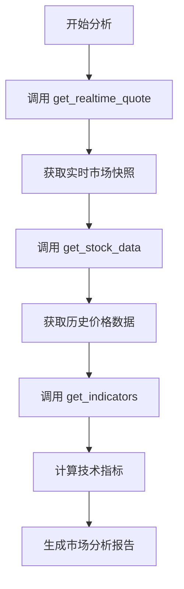
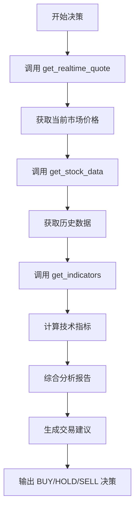

# 实时行情工具集成到Agent

## 更新日期
2025-11-01

## 更新概述
将实时股票行情工具 `get_realtime_quote` 集成到市场分析师（Market Analyst）和交易员（Trader）两个核心Agent中，使它们能够获取最新的市场数据进行分析和决策。

## 更新内容

### 1. 创建实时行情工具

**新文件**: `tradingagents/agents/utils/realtime_quote_tools.py`

```python
@tool
def get_realtime_quote(symbol: str) -> str:
    """
    Retrieve real-time stock quote data from XueQiu (雪球) interface.
    
    Supports A-shares, US stocks, and Hong Kong stocks.
    Returns current market data including price, volume, and key metrics.
    """
```

**功能特点**:
- 支持A股、美股、港股
- 返回实时价格、成交量、市盈率、市值等关键指标
- 使用LangChain的@tool装饰器，可被LLM直接调用

### 2. 更新工具导入

**文件**: `tradingagents/agents/utils/agent_utils.py`

添加了实时行情工具的导入：
```python
from tradingagents.agents.utils.realtime_quote_tools import (
    get_realtime_quote
)
```

### 3. 集成到Market Analyst

**文件**: `tradingagents/agents/analysts/market_analyst.py`

#### 3.1 导入工具
```python
from tradingagents.agents.utils.agent_utils import get_stock_data, get_indicators, get_realtime_quote
```

#### 3.2 添加到工具列表
```python
tools = [
    get_stock_data,
    get_indicators,
    get_realtime_quote,  # 新增
]
```

#### 3.3 更新系统提示词
添加了工具使用指南：
```
Available tools:
1. get_realtime_quote: Get current real-time market data - Use this first
2. get_stock_data: Retrieve historical price data
3. get_indicators: Calculate technical indicators

Recommended workflow:
- First call get_realtime_quote to get the latest market snapshot
- Then call get_stock_data for historical analysis
- Finally use get_indicators for technical analysis
```

### 4. 集成到Trader

**文件**: `tradingagents/agents/trader/trader.py`

#### 4.1 导入工具
```python
from tradingagents.agents.utils.agent_utils import get_stock_data, get_indicators, get_realtime_quote
```

#### 4.2 添加到工具列表
```python
tools = [
    get_stock_data,
    get_indicators,
    get_realtime_quote,  # 新增
]
```

#### 4.3 更新决策流程
```
Before making your final trading decision, you should:
1. Use get_realtime_quote to get the current market price and real-time metrics
2. Use get_stock_data to retrieve recent price data
3. Use get_indicators to calculate technical indicators
4. Analyze the retrieved data to make an informed decision
```

## 工作流程

### Market Analyst 工作流程



### Trader 工作流程



## 使用示例

### Market Analyst 使用实时行情

当Market Analyst被调用时，它现在可以：

1. **获取实时快照**
```python
# LLM会自动调用
get_realtime_quote("600000")
# 返回：当前价格、成交量、市盈率等实时数据
```

2. **结合历史数据分析**
```python
get_stock_data("600000", "2025-10-01", "2025-11-01")
# 返回：历史OHLCV数据
```

3. **计算技术指标**
```python
get_indicators("600000", ["rsi", "macd", "boll"])
# 返回：技术指标计算结果
```

### Trader 使用实时行情

Trader在做出交易决策时：

1. **首先获取当前市场价格**
```python
get_realtime_quote("AAPL")
# 返回：当前价 150.25 USD，成交量 50M，市盈率 28.5 等
```

2. **基于实时价格给出建议**
```
FINAL TRANSACTION PROPOSAL: **BUY** | PRICE RANGE: 149.50-151.00 USD/share | POSITION: 15%
```

## 优势

### 1. 数据时效性
- ✅ 获取最新的市场价格
- ✅ 实时成交量和市值数据
- ✅ 当前的估值指标（P/E、P/B）

### 2. 决策准确性
- ✅ 基于最新价格给出交易建议
- ✅ 避免使用过时的历史数据
- ✅ 更准确的价格区间建议

### 3. 分析完整性
- ✅ 实时数据 + 历史数据 + 技术指标
- ✅ 多维度综合分析
- ✅ 更全面的市场洞察

### 4. 用户体验
- ✅ 自动获取最新数据
- ✅ 无需手动更新价格
- ✅ 分析结果更具参考价值

## 配置要求

### 环境变量
确保设置了雪球Token：
```bash
export XUEQIU_TOKEN="your_token_here"
```

### 获取Token
参见：[docs/XUEQIU_TOKEN_SETUP.md](XUEQIU_TOKEN_SETUP.md)

## 影响范围

### 修改的文件
1. ✅ `tradingagents/agents/utils/realtime_quote_tools.py` - 新建
2. ✅ `tradingagents/agents/utils/agent_utils.py` - 添加导入
3. ✅ `tradingagents/agents/analysts/market_analyst.py` - 集成工具
4. ✅ `tradingagents/agents/trader/trader.py` - 集成工具

### 不受影响的部分
- 其他Agent（News Analyst, Fundamentals Analyst等）
- 现有的工具函数
- 数据流接口
- 图执行逻辑

## 测试建议

### 1. 单元测试
测试实时行情工具：
```python
from tradingagents.agents.utils.realtime_quote_tools import get_realtime_quote

# 测试A股
result = get_realtime_quote.invoke({"symbol": "600000"})
assert "Current_Price" in result

# 测试美股
result = get_realtime_quote.invoke({"symbol": "AAPL"})
assert "Current_Price" in result
```

### 2. 集成测试
运行完整的分析流程：
```bash
# 确保设置了Token
export XUEQIU_TOKEN="your_token"

# 运行分析
python main.py --ticker 600000 --date 2025-11-01
```

### 3. 验证点
- ✅ Market Analyst报告中包含实时价格数据
- ✅ Trader决策基于最新市场价格
- ✅ 价格建议区间合理（接近当前价格）
- ✅ 所有三个市场（A股/美股/港股）都能正常工作

## 故障排除

### 问题1：Token未设置
**症状**：实时行情获取失败
**解决**：设置 `XUEQIU_TOKEN` 环境变量

### 问题2：Token过期
**症状**：返回认证错误
**解决**：从雪球网站重新获取Token

### 问题3：工具未被调用
**症状**：分析报告中没有实时数据
**解决**：检查LLM是否正确绑定了工具

## 后续优化

### 短期优化
1. 添加缓存机制（避免重复调用）
2. 添加错误重试逻辑
3. 优化提示词，引导LLM优先使用实时数据

### 长期优化
1. 支持批量获取多个股票的实时行情
2. 添加实时行情的历史记录
3. 集成到更多Agent中
4. 添加实时行情的可视化展示

## 相关文档

- [实时行情快速开始](REALTIME_QUOTES_QUICKSTART.md)
- [雪球Token配置](XUEQIU_TOKEN_SETUP.md)
- [实时行情实现详解](REALTIME_QUOTES_IMPLEMENTATION.md)
- [Token参数移除说明](XUEQIU_TOKEN_PARAMETER_REMOVAL.md)

## 总结

本次更新成功将实时股票行情工具集成到Market Analyst和Trader两个核心Agent中，使它们能够：

1. ✅ 获取最新的市场价格和指标
2. ✅ 基于实时数据进行分析和决策
3. ✅ 提供更准确的交易建议
4. ✅ 支持A股、美股、港股三个市场

这大大提升了系统的数据时效性和决策准确性，为用户提供更有价值的分析结果。

---

**更新执行者**：Kiro AI Assistant  
**更新日期**：2025-11-01  
**文档版本**：1.0
